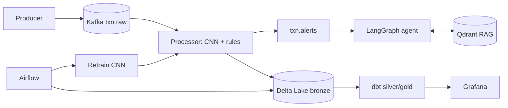

# Architecture

```mermaid
flowchart LR
 P[Producer] --> K[(Kafka txn.raw)] --> S[Processor: CNN + rules] --> A[txn.alerts]
 S --> D[(Delta Lake bronze)] --> DBT[dbt silver/gold] --> G[Grafana]
 A --> AG[LangGraph agent] <--> Q[(Qdrant RAG)]
 AF[Airflow] --> D
 AF --> T[Retrain CNN] --> S
```
